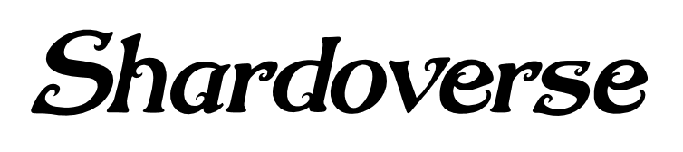

A Roguelike  
Peer-to-Peer Multi Player  
Dungeon Explorer  
and Fortress Builder (? maybe later)  
Game written in Rust.  

## Idea and story

The world is shattered to pieces, leaving the survivors each on his own shard of the universe.  

Now one has to run, to explore and to gather what is left, what is needed to survive, in the depth of the shard.

Set in a broken fantasy world with a bit of steam, the player starts on his own in an unfamiliar place.  
Is he alone, are there other survivors, other shards?

## This is a learning project!

We are one software developer (experienced in writing business software & database applications, not games) and two newcomers, all interested in game programming.

Goal of this project is to learn:
- the Rust programming language and
- a bit of game programming.

We chose to write a little Roguelike game and maybe add some extras.

## Current state
The project has not really started yet.  
Currently, we are setting up the development environment, select the tools and libraries we will use,
choose some basic assets for graphics and sound and such things.


## Decisions made

| What                                      | Why                                                                                                 |
|-------------------------------------------|-----------------------------------------------------------------------------------------------------|
| [`Roguelike`](http://www.roguebasin.com/) | Programming a roguelike should be simple enough and sound like fun!                                 |
| [`Rust`](https://www.rust-lang.org/)      | Rust is said to be fast and reliable at the same time, so it should be perfect for games            |
| [`MSys2`](https://www.msys2.org)          | To develop somewhat independent of the underlying system platform                                   |
| [`MinGW64`](http://mingw.org/)            | MinGW goes together with MSys2, the decision here is to use 64-Bit libs for simplicity              |
| [`SDL2`](https://wiki.libsdl.org/)        | A well probed and platform independent set of libraries                                             |
| [`git`](https://https://git-scm.com/)     | subversion would have done since this is just for learning, but let's do it right from the start.   |
| [`GitHub`](https://github.com/)           | Er, ok, we are already here. Rust is here, some libs are here, some other games, and so we are too. |

## Considerations

| What                                                  | Why                                                                                      |
|-------------------------------------------------------|------------------------------------------------------------------------------------------|
| [`amethyst`](https://crates.io/crates/amethyst)       | Hm, data-driven development looks like a good idea, maybe a bit strange to grasp. What is the relation to SDL2? Is Amethyst a replacement for SDL2 or can both be integrated? |
| [`bracket-lib`](https://crates.io/crates/bracket-lib) | Formerly known as RLTK/rltk_rs. Wow, that looks cool, and a mountain of docs is available! But that may be a bit much, since our goal is to learn how to do it in Rust by ourselves. On the other hand, may be we could integrate some things. |


## Setting up the development environment

### Install MSYS2 + MinGW64
As described here:  [`MSys2-install`](https://www.msys2.org/wiki/MSYS2-installation/)  
(and possibly this may help:  [`unix-linux-environment-windows`](https://www.booleanworld.com/get-unix-linux-environment-windows-msys2/) )

Now there should be an Icon on the desktop to start the MSys2-Shell.  
For the further steps, open this shell.  
May be it is now the right time to configure this shell/window for your liking.

### Updating the Msys2- and MinGW64-Packages and -Repositories
    pacman -Syuu

(repeat this until there is nothing more to update)

### Install the development toolchain
    pacman -S mingw-w64-x86_64-toolchain

### Add several necessary development tools
    pacman -S base-devel
    pacman -S msys2-devel

### Install git for Msys2
as described at: [`git: Install-inside-MSYS2-proper`](https://github.com/git-for-windows/git/wiki/Install-inside-MSYS2-proper)


    pacman -S ssh-pageant  (not tested yet)
    https://github.com/cuviper/ssh-pageant
    
    
#### In short:
- Edit the pacman configuration file of Msys2: pacman.conf
- add the git-for-windows-**mingw32** for mingw64 in the strangely twisted way described there
- add and accept their signing-keys
- update Msys2 repeatedly by using ```pacboy update``` until there is nothing more to update
- install git via: ```pacboy sync git:x git-doc-html:x git-doc-man:x git-extra: curl:x```

### Just for fun, we'll not really need this
    pacman -S mingw-w64-x86_64-vulkan-devel

### Installing the SDL2-Library:
to check which SDL2-Packets are available for Mingw64:

    pacman -Ss mingw-w64-x86_64-SDL2

#### Then at least install the following:
    pacman -S mingw-w64-x86_64-SDL2_image
    pacman -S mingw-w64-x86_64-SDL2_ttf
    pacman -S mingw-w64-x86_64-SDL2_mixer
    pacman -S mingw-w64-x86_64-SDL2_gfx

### Generate the manpages for the installed Msys2-Tools
    /usr/bin/mandb --quiet

------------------
## Install Rust
If not already done, add a Variable named 'HOME' to the Windows users environment variables:

    HOME=C:\<your own homedir>

This directory is the location from which all the dot-files will be read when the shell is started, in Windows notation.
(one description of how to do this can be seen here: [`environment-variables-windows-10`](https://www.techjunkie.com/environment-variables-windows-10/) )

Add the location of the Mingw64 binaries to the Windows users environment variables PATH, also in Windows notation:

    PATH=C:\msys64\mingw64\bin

Then get the initial Rust-Install (take the one for the 64-Bit architecture)
as described here:  [`Install Rust`](https://www.rust-lang.org/tools/install)

Start From within the MSYS2-Shell:

    rustup-init.exe
    select: 2) Customize installation
    enter the following Host-Triple:           --> x86_64-pc-windows-gnu
    Default toolchain?                         --> stable
    Profile (which tools and data to install)? --> default
    Modify PATH variable? (y/n)                --> y  (only for checking)

after that start the installation with: [return]

    select 1) Proceed with installation (default)

Now it's time to configure the environment within the shell.

### Configure the environment within the MSys2-Shell

In one of the dot-files which get executed at start of the shell (in login-mode), maybe in .bash_profile,
add the location of the Rust binaries to the PATH-variable (now in the Unix notation):

      export PATH="/c/Users/<your username>/.cargo/bin:$PATH"

------------------
> An example for a similar environment is the Asteroids-alike-game [`rust-belt`](https://github.com/johnthagen/rust-belt)!

## Clone the git repository of Shardoverse
In the MSys2-Shell
navigate to your intended base development directory,
then clone the files from GitHub by issuing:

    git clone https://github.com/clunion/shardoverse

That creates a new sub directory with all the necessary files in it.

## Build and Run

To build:

    cargo build


To run:

    cargo run --release

## Some Tools
For a secure login to GitHub from our Windows-PCs, SSH is used.

After trying to get the Git-in-Msys2 to use the SSH-Agent 'KeeAgent' from KeePass with no real success
(both tools are able to access this GitHub repository, but not automagically integrated), 
it was resorted to use [`TortoiseGit`](https://tortoisegit.org/) instead. 
Some additional configuration-Info can be found here:  
[`git-for-windows-where-to-find-my-private-rsa-key`](https://serverfault.com/questions/194567/how-do-i-tell-git-for-windows-where-to-find-my-private-rsa-key)  


To automate the login with KeePass2 via KeeAgent, a setup as described here was tried:
[`keepass-and-keeagent-setup`](https://code.mendhak.com/keepass-and-keeagent-setup/)  
Maybe someone has more luck.


Originally it was intended not to use TortoiseGit from the start, because the intention was/is to learn Git the console way first.


# License(s)
The game Shardoverse and all originally created parts of it (source code, texts, descriptions and such) are licensed under the MIT license, see the LICENSE.md file.

Parts which are used by the game, namely several assets like graphics, tiles, tilesets, textures, icons, cursors, sounds, music and fonts,
which are not originally created by direct contributors to Shardoverse, are holding their own licenses.  
The use within Shardoverse does not remove those licenses.  

For each asset a file describing the origin of the data and, wherever possible, naming the copyright owner and the license.

There is absolutely no intention to infringe any copyrights, trademarks or patents of their respective owners.

If that should happen nevertheless, that would be an accidental oversight and will be corrected.

# Assets

The following Assets are (or will be) used, if their creators/owners do not object:

- ./assets/audio/effects  

- ./assets/audio/music  
    [`cave themeb4 from Brandon75689`](https://opengameart.org/content/cave-theme)  

- ./assets/cursors  

- ./assets/fonts  
    [`Dragonfly Font by Rick Mueller`](https://www.fontspace.com/dragonfly-font-f5775)  
    [`FiraSans-Regular.ttf by Mozilla`](https://github.com/mozilla/Fira)  
    [`NugieRomantic Font by cove703`](https://www.fontspace.com/nugie-romantic-font-f33764)  

- ./assets/graphics/2D/tiles  
    [`DungeonCrawlStoneSoupFull by many`](https://github.com/crawl/tiles/tree/master/releases)  

-   ./assets graphics/2D-isometric/tiles  
    [`rltiles-pack by Mitsuhiro Itakura (maintainer)`](https://opengameart.org/content/64x64-isometric-roguelike-tiles)  

- ./assets/graphics/3D/meshes  
- ./assets/graphics/3D/textures  
- ./assets/images  
- ./assets/videos  


# Maintainer
* [@clunion](https://github.com/clunion)


